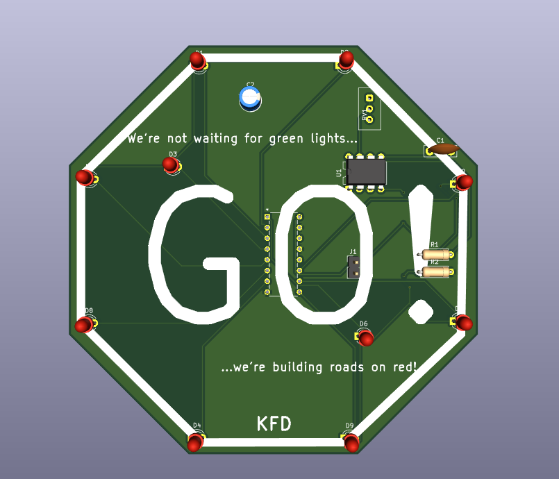
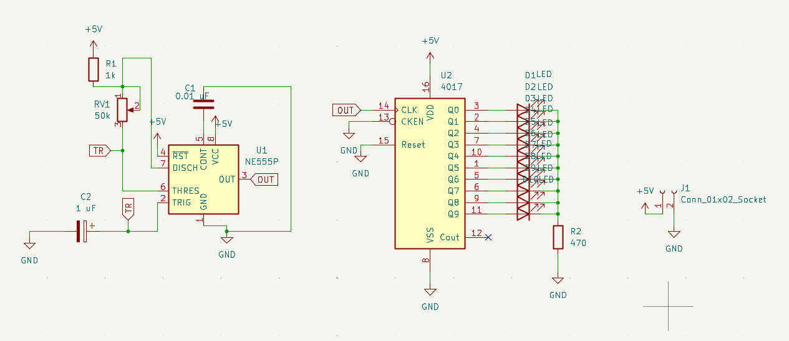
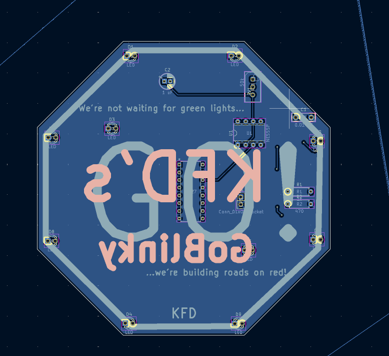
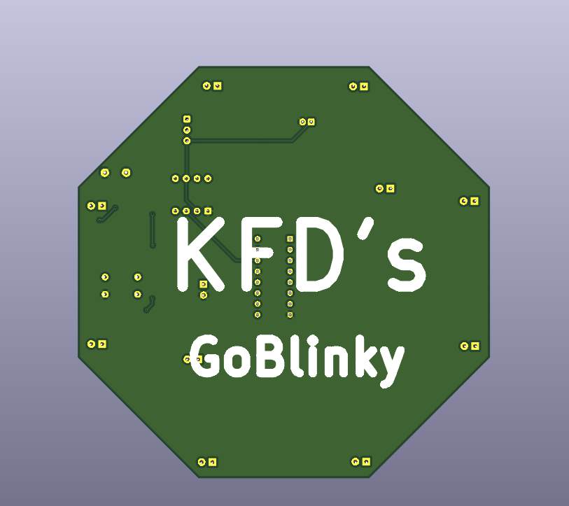

# My GoBlinky project

This is a Chaser Board, sometimes called a Chaser! Made all from scratch.

[Watch her in action](https://youtube.com/shorts/273GlsKtG_Y?si=tUAFjzuMFvb2yS4Z):
https://youtube.com/shorts/273GlsKtG_Y?si=tUAFjzuMFvb2yS4Z

[BOM](#bill-of-materials)

It's in the shape and design of a STOP sign, but it says "GO". Periodtt!
Bars are from my favourite spoken word artist, IBQuake :D

My schematic design:

My pcb:

3d view of my chaser board:

And the back:

## BILL OF MATERIALS

| Item                     | Cost   | Quantity | Description                  |
|--------------------------|--------|----------|------------------------------|
| Blinky Kit from Hack Club   | $15.00 | 1        | Kit for event                | https://stasis.hackclub.com/starter-projects/blinky |
| PCB (JLCPCB)             | $6.60  | 1        | Base of the blinky           |[Link](https://trade.jlcpcb.com/checkout) |
| Solder Iron with shipping costs           | $16.31  | 1        | Used to assemble the blinky  | [Link](http://amazon.com/gp/product/B098JD8HD3/ref=ewc_pr_img_1?smid=A19YGYI63H9AEE&th=1) |